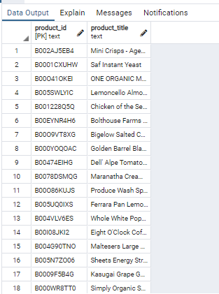

# Amazon_Vine_Analysis - Module_16

## Overview

* For this project, I looked at Grocery dataset to analyze the amazon reviews and provide the summarized report to Jennifer for SellBy project.
** From the dataset, below tables were created which are primary driving factor to analyze the reviews to help the manufacturers and publishers to get teh feedback and use these datapoints for their future business plans or changes in the products/services.

**
Results: Using bulleted lists and images of DataFrames as support, address the following questions:

***How many Vine reviews and non-Vine reviews were there?
** Out of total reviews, only 16,612 were vine reviews.

How many Vine reviews were 5 stars? How many non-Vine reviews were 5 stars?
** Out of total reviews received with greater thann20votes only 28,348 had 5 star rating. Further, there were 28,287 were non vine reviews(unpaid) 5star and 61 (vine_reviews)paid 5star rating.

What percentage of Vine reviews were 5 stars? What percentage of non-Vine reviews were 5 stars?
32.79% reviews were paid 5star reviews and 55.46% were unpaid 5star reviews.

###Summary:

From the dataset and analysis, there is significant difference inthe percentage of paid vs unpaid reviews. Only 61 out of total 28348 were paid reviews, hence, it suggest that unpaid reviews driving factor to influence any decision for manufacturers or publishers to make further decision from the feedback over datapoints.

*** Based on the dataset, there were 4 tables created (please loook at below snapshots)
## Review_ID_Table

##Products_Table

##Customer_Table

##Vine_Table

## Paid 5 Star rating vs Unpaid 5 star rating

